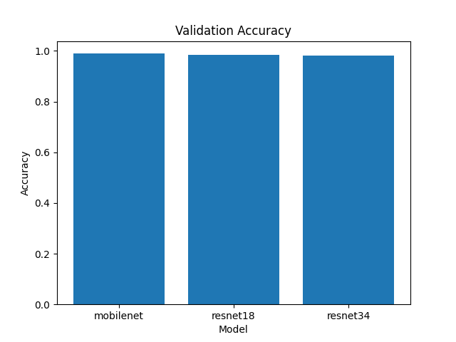
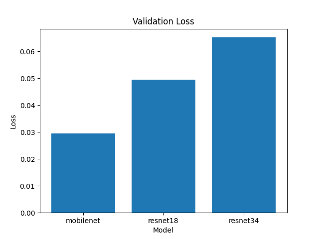

# 🚀 NEU Surface Defect Classification API (FastAPI + Docker)

A production-ready machine learning system for steel surface defect classification using deep learning, with explainability and API deployment.

---

## 📌 Overview

This project implements an **end-to-end computer vision pipeline** for industrial surface defect detection:

* Training deep learning models on the NEU surface defect dataset
* Comparing multiple architectures (ResNet18, ResNet34, MobileNet)
* Interpreting model predictions using Grad-CAM
* Serving predictions via a FastAPI REST API
* Deploying with Docker for reproducibility

---

## 🧠 Features

* ✅ Deep Learning models (PyTorch / PyTorch Lightning)
* ✅ Model comparison across architectures
* ✅ FastAPI-based inference API
* ✅ 🔍 Grad-CAM explainability
* ✅ 📊 MLflow experiment tracking (optional)
* ✅ 🐳 Dockerized deployment
* ✅ Clean, modular project structure

---

## 📊 Model Comparison

Three architectures were evaluated:

* ResNet18
* ResNet34
* MobileNet

### Accuracy Comparison



### Loss Comparison



### 📌 Observations

* ResNet34 achieved the highest accuracy with stable convergence
* MobileNet provides a lightweight alternative with faster inference
* ResNet18 offers a good trade-off between performance and efficiency

---

## 🔍 Model Explainability (Grad-CAM)

Grad-CAM is used to visualize which regions influence the model’s prediction.

<p align="center">
  
  
</p>

**Left:** Original Image
**Right:** Grad-CAM Heatmap

The model correctly focuses on defect regions, improving interpretability and trust in predictions.

---


## 📂 Project Structure

```
.
├── api/                # FastAPI application
├── src/                # Training, inference, utilities
├── assets/             # Plots + Grad-CAM images
├── models/             # Saved checkpoints (ignored in Git)
├── data/               # Dataset (ignored in Git)
├── tests/              # Sample test images
├── Dockerfile
├── requirements.txt
└── README.md
```

---

## ⚙️ Setup (Local)

### 1️⃣ Clone the repository

```
git clone https://github.com/DeepuLIN/neu-fastapi-docker.git
cd neu-fastapi-docker
```

---

### 2️⃣ Create environment

```
python -m venv venv
source venv/bin/activate
pip install -r requirements.txt
```

---

### 3️⃣ Run FastAPI

```
uvicorn api.main:app --reload
```

Open:

```
http://localhost:8000/docs
```

---

## 🐳 Run with Docker

### 1️⃣ Build image

```
docker build -t neu-api .
```

---

### 2️⃣ Run container

```
docker run -p 8000:8000 neu-api
```

---

### 3️⃣ Access API

```
http://localhost:8000/docs
```

---

## 📡 API Endpoints

### 🔹 Health Check

```
GET /
```

---

### 🔹 Image Prediction

```
POST /predict/image
```

Upload an image file and receive:

* Predicted class
* Confidence score
* Grad-CAM visualization (if enabled)

---

## 🧪 Example Usage

```
curl -X POST "http://localhost:8000/predict/image" \
  -H "accept: application/json" \
  -H "Content-Type: multipart/form-data" \
  -F "file=@tests/1.jpg"
```

---

## 📊 Model Details

* Architecture: ResNet18 / ResNet34 / MobileNet
* Framework: PyTorch Lightning
* Explainability: Grad-CAM
* Tracking: MLflow

---

## ⚠️ Notes

* Dataset is **not included**
* Model checkpoints are excluded for lightweight version control
* Use `src/download_data.py` to fetch dataset

---

## 🚀 Future Improvements

* CI/CD pipeline (GitHub Actions)
* Model registry & versioning (MLflow)
* Cloud deployment (AWS / Azure / GCP)
* Batch inference support

---

## 👤 Author

Deepak L
Machine Learning Engineer | Computer Vision | MLOps

---

## ⭐ If you found this useful

Give it a star ⭐ on GitHub — it helps a lot!

